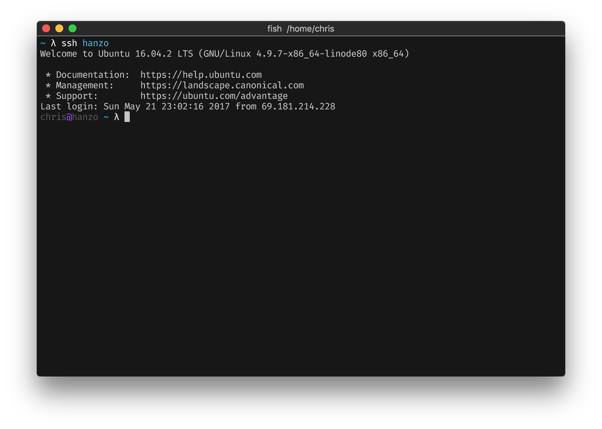

#### doughsay
> A theme for [Oh My Fish][omf-link].

[](/LICENSE)
[](https://fishshell.com)
[](https://www.github.com/oh-my-fish/oh-my-fish)

<br/>

A clean vcs aware theme with optional [asdf](https://github.com/asdf-vm/asdf) right-prompt.

## Install

```fish
$ omf install doughsay
```


## Features

* vcs aware (git, mercurial, svn)
* [asdf](https://github.com/asdf-vm/asdf) aware (optionally display current tool versions in right-prompt)


## Configuration

The best place to put these is in your `$OMF_CONFIG/init.fish` (usually `~/.config/omf/init.fish`).  Set them by adding a line to that file like this:

```
set -g theme_display_asdf "yes"
```

* `theme_display_asdf` - set to "yes" to display asdf tool versions in right prompt
* `theme_display_user` - set to "yes" to show username and hostname in prompt
* `theme_hood_ornament` - set to whatever you want to show up at the end of your prompt (defaults to "λ")


## Screenshots

Showing git repository statuses:

<p align="center">
  
</p>

Showing [asdf](https://github.com/asdf-vm/asdf) tool versions in the right-prompt:

> set -g theme_display_asdf "yes"

> NOTE: this requires installing the [asdf plugin](https://github.com/doughsay/omf-asdf) in oh-my-fish: `omf install asdf`

<p align="center">
  
</p>

Showing user@hostname when logged into a remote machine:

> set -g theme_display_user "yes"

<p align="center">
  
</p>


# License

[MIT][mit] © [Chris Dosé][author] et [al][contributors]


[mit]:            https://opensource.org/licenses/MIT
[author]:         https://github.com/doughsay
[contributors]:   https://github.com/doughsay/omf-theme-doughsay/graphs/contributors
[omf-link]:       https://www.github.com/oh-my-fish/oh-my-fish

[license-badge]:  https://img.shields.io/badge/license-MIT-007EC7.svg?style=flat-square
